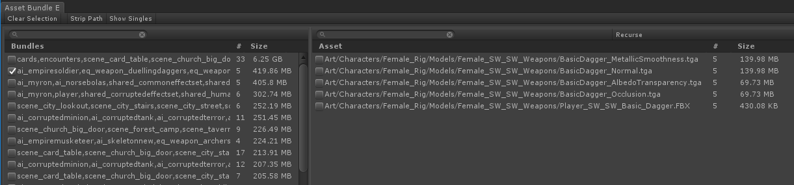
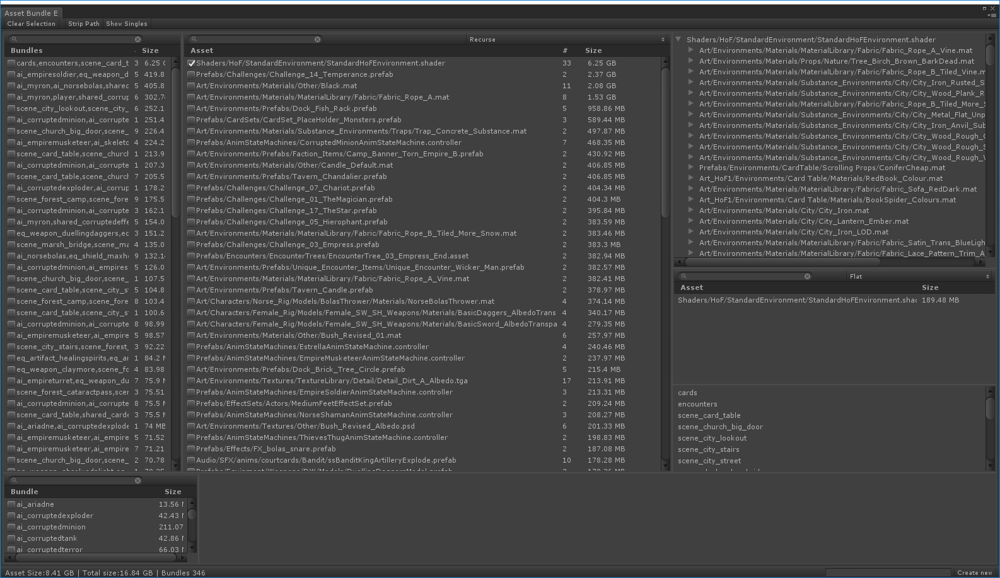
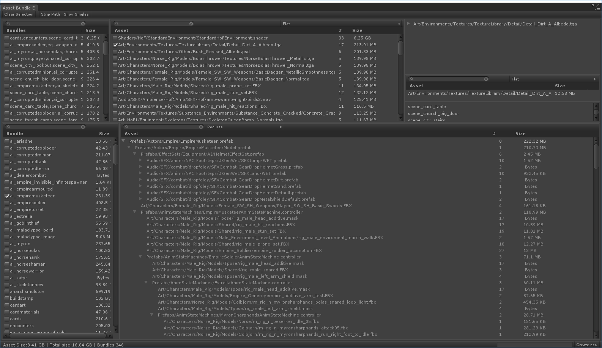

# AssetBundleEditor
Utility for unity to help organise assets in bundles 

Works like this
When we build asset bundles (Custom->Build->Asset Bundles), we parse the build log file for each asset path and how big it is on disk*. We save out a csv file of asset path and byes.

On opening the editor window (Custom->Build->Asset Bundle Editor), we iterate all the asset bundles AssetDatabase.GetAllAssetBundleNames() and build a dependency tree by iterating all the asset dependencies. This takes a couple of minutes.

When using it, there are 2 modes.

1. Identify assets that are duplicated over multiple bundles 
2. Identify common groups of dependent assets between bundles 

Here are examples of use cases

Here 5 bundles (ai_empiresoldire,eq_weapon_dualingdaggers....) all reference the same 4 textures and one fbx. 

Ideally those 4 textures and one fbx will be placed in their own bundle. That will save 4/5 of 419Mb on disk and introduce one seek for each of those bundles.

Case 2

The environment shader is duplicated in 33 bundles taking an alledged 6.25 GB of space (that is wrong, possibly due to it basing the size on having all the variations compiles 189.48 Mb)

In this case the top right pane shows me all the reverse dependencies of the asset selected, so I can find out how it gets included.
Right middle pane shows me the names of the 33 asset bundles that use it.

You can also explore an asset bundle and the assets and sizes within it

*This falls down for shaders (they can be different sizes in each instance depending on variation count generated) also falls down for fbx (sometimes you only reference different parts of it, eg anim)